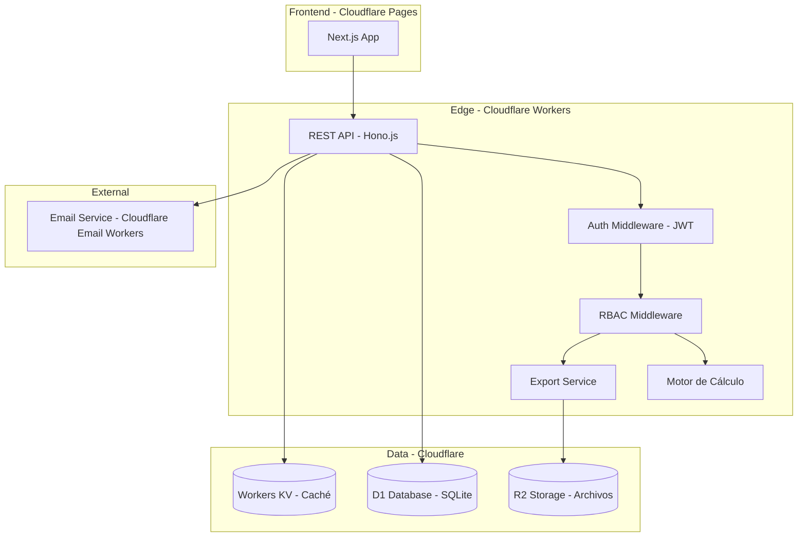
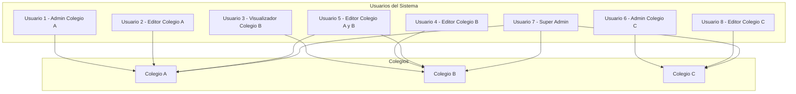
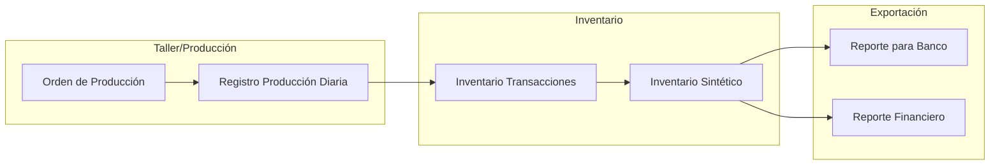

# Plan Actualizado: Sistema de Gestión de Uniformes Escolares - Cloudflare Workers

## 1. Respuestas a Tus Preguntas

### 1.1 ¿Cuál es mejor: Cloudflare D1 o Workers KV?

| Característica | Cloudflare D1 | Cloudflare Workers KV |
|----------------|---------------|----------------------|
| Tipo | Base de datos SQL (SQLite) | Almacenamiento clave-valor |
| Consultas relacionales | ✅ Sí (JOINs, WHERE, GROUP BY) | ❌ No |
| Múltiples colegios | ✅ Nativo (filas colegio_id) | ⚠️ Limitado (consultas por prefijo) |
| Transacciones | ✅ ACID | ❌ No |
| Consultas complejas de inventario | ✅ Optimizado | ❌ Limitado |
| Exportación de reportes | ✅ Fácil con SQL | ⚠️ Requiere lógica adicional |
| Casos de uso | Datos relacionales, inventarios, historiales | Caché, sesiones, configuración |

**Recomendación: Cloudflare D1**

Tu sistema requiere:
- Consultas relacionales (producto ↔ talla ↔ costo ↔ inventario)
- Múltiples colegios con usuarios de acceso variado
- Historial de precios y transacciones
- Reportes complejos de costos

D1 es la opción correcta. KV se puede usar complementariamente para caché de sesiones y configuraciones.

---

### 1.2 Stack Tecnológico para Cloudflare Workers

| Capa | Tecnología | Justificación |
|------|-----------|---------------|
| **Backend** | Cloudflare Workers (Hono.js) | Framework ligero, soporte nativo para D1, edge computing |
| **Base de Datos** | Cloudflare D1 (SQLite) | Relacional, transacciones, perfecto para datos de inventario |
| **Almacenamiento Caché** | Workers KV | Sesiones, configuraciones por colegio |
| **Frontend** | Next.js + React (desplegado en Cloudflare Pages) | SSR, SEO, integrado con ecosistema Cloudflare |
| **Base de Datos Frontend** | Drizzle ORM | Migrate D1, tipo seguro, ligera |
| **Autenticación** | JWT + Hono JWT middleware | Stateless, escalable en edge |
| **Motor de Cálculo** | Módulo TypeScript interno | Replicar fórmulas del Excel con precisión |
| **Exportación** | ExcelJS + @pdftron/wasm | Generar Excel y PDF |
| **UI Library** | Ant Design / shadcn/ui | Componentes para tablas complejas |
| **Despliegue** | Cloudflare Workers + Pages | Edge global, gratuito hasta límites generosos |

---

### 1.3 Arquitectura del Sistema en Cloudflare



---

## 2. Análisis Funcional Completo del Excel

### 2.1 ¿Qué hace actualmente este Excel?

Este documento es un sistema completo de **Costeo, Precios y Control de Inventario** diseñado para la manufactura de uniformes escolares.

#### Flujo Secuencial a través de sus hojas:

**A. Receta o Bill of Materials (BOM):**

| Hoja Excel | Función | Detalle |
|------------|---------|---------|
| `PesoMatPrima` | Calcula consumo de tela en gramos por talla | Desde talla 2 hasta 50/4XL, agrega 8% de merma |
| `Acc` (Accesorios) | Detalla costo de avíos y accesorios por prenda | Botones, cierres, hilos, etiquetas, bordados, serigrafía |
| `Tela` | Base de datos de materia prima | Piqué, Algodón, etc. con rendimientos (m/kg), densidades y precios |

**B. Mano de Obra y Costos Indirectos:**

| Hoja Excel | Función | Detalle |
|------------|---------|---------|
| `ManoDeObra` | Tarjetas de confección escalonadas | Tarifas por rangos de tallas |
| `Fij&Var` | Costos fijos mensuales | Corte, administración, limpieza/planchado |
| `fijosXprenda` | Prorrateo por prenda | Usa "Factor de Complejidad" para distribuir costos |

**C. Motor de Precios y Rentabilidad:**

| Hoja Excel | Fórmula | Descripción |
|------------|---------|-------------|
| `CostoBruto` | Tela + Accesorios + Mano de Obra | Costo directo de producción |
| `CostoAntesImp` | CostoBruto + Costos Fijos/Variables | Costo operativo completo |
| `CostoTotal` | CostoAntesImp + 13% IVA | Costo final con impuestos |
| `PrecioDeVenta` | Definido por usuario | Precio de venta por talla |
| `UtilidadNeta` | PrecioDeVenta - CostoTotal | Ganancia exacta por prenda |
| `%Ganancia` | (Utilidad / PrecioVenta) × 100 | Margen de rentabilidad |

**D. Gestión de Inventario:**

| Hoja Excel | Función | Limitación |
|------------|---------|------------|
| `INVENTARIO` | Stock físico por talla | Solo una "foto" estática, sin trazabilidad |
| `CostoInventario` | Stock × Costo producción | Capital inmovilizado calculado |
| `PrecioAntiguos` | Historial de precios | Manual, sin automatización |
| `PrecioAgo2024` | Precios actualizados | Sin comparación automática |

---

### 2.2 Oportunidades de Mejora (Por qué salir de Excel)

#### Problema 1: Estructura Rígida de Tallas (Matriz 2D)
> **Excel:** Las tallas son columnas. Si fabricas una talla nueva, debes insertar columnas en múltiples hojas y rogar que las fórmulas no se rompan.
>
> **Solución Web:** Las tallas son registros en una tabla. Agregar una talla nueva es un formulario con 3 campos.

#### Problema 2: Falta de Trazabilidad en Inventario
> **Excel:** Muestra una "foto" estática del inventario (ej. "AL 21/07/2026"), sin registrar entradas, salidas ni mermas.
>
> **Solución Web:** Inventario basado en transacciones. El stock se calcula sumando entradas y restando salidas automáticamente.

#### Problema 3: Multi-Tenancy Manual
> **Excel:** Para otro colegio, debes duplicar el archivo. Si el hilo sube de precio, debes actualizar 10 archivos distintos.
>
> **Solución Web:** Catálogo centralizado. Un solo cambio en el precio de una tela se propaga automáticamente a todos los productos y colegios que la usan.

#### Problema 4: Riesgo de Corrupción y Colaboración
> **Excel:** Si tú estás calculando un costo y un operario necesita ver el stock, el archivo en red o por correo genera versiones conflictivas.
>
> **Solución Web:** Múltiples usuarios concurrentes con acceso en tiempo real y control de versiones automático.

---

### 2.3 Puntos Críticos a Mejorar (Continuación)

| # | Problema en Excel | Solución en Sistema |
|---|-------------------|---------------------|
| 1 | **Errores de punto flotante** en cálculos de costos | Usar `decimal.js` o `big.js` para precisión financiera |
| 2 | **Fórmulas hardcodeadas** en celdas del Excel (difíciles de auditar) | Lógica encapsulada en funciones TypeScript con tests unitarios |
| 3 | **Sin validación de datos** (ej: precio negativo, talla inexistente) | Validaciones en schema de base de datos + validación en API |
| 4 | **Sin historial de cambios** en precios y costos | Tabla `historico_precios` con trazabilidad completa |
| 5 | **Cálculo de merma** (+8%) fijo | Hacer configurable por producto (default 8%) |
| 6 | **Costos indirectos** distribuidos manualmente | Distribución automática basada en producción total del mes |
| 7 | **Sin auditoría** de quién cambió qué | Tabla `auditoria` con registro de todas las modificaciones |
| 8 | **Dependencia de archivo Excel** (un solo punto de fallo) | Base de datos centralizada con backups automáticos |
| 9 | **Cálculo de tipo de cambio** disperso | Tabla `per_soles` con vigencia y cálculo automático |
| 10 | **Sin cálculo de precio sugerido** | Módulo que sugiera precio basado en margen deseado |
| 11 | **Inventario estático** sin trazabilidad | Sistema de transacciones de inventario (entradas/salidas/mermas) |
| 12 | **Multi-colegio duplicado** | Base de datos multi-tenant con catálogo centralizado |

### 2.3 Ejemplo de Mejora: Motor de Cálculo vs Excel

```typescript
// ❌ Excel: Fórmula en celda =B5*C5+D5 (invisible, sin validación)

// ✅ Sistema: Función tipada con validación
interface CalculoCosto {
  materiaPrima: Decimal;
  accesorios: Decimal;
  manoObra: Decimal;
  costoFijo: Decimal;
  costoIndirecto: Decimal;
  iva: Decimal; // 13%
  
  calcular(): ResultadoCalculo {
    const costoBruto = this.materiaPrima
      .add(this.accesorios)
      .add(this.manoObra);
    
    const antesImpuestos = costoBruto.add(this.costoFijo).add(this.costoIndirecto);
    const total = antesImpuestos.mul(1.13);
    
    return { costoBruto, antesImpuestos, total };
  }
}
```

---

## 3. Modelo de Multi-tenancy y Permisos

### 3.1 Diagrama de Acceso



### 3.2 Modelo de Permisos

| Rol | Colegios | Funcionalidades |
|-----|----------|-----------------|
| **Super Admin** | Todos | CRUD completo de colegios, usuarios, configuración global |
| **Admin Colegio** | 1 colegio | CRUD completo (productos, precios, inventario, costos) |
| **Editor** | 1-N colegios | Crear/editar productos, precios, inventario |
| **Visualizador** | 1-N colegios | Solo lectura, exportar reportes y detalles de costos |

### 3.3 Tabla de Usuarios Mejorada

```typescript
interface Usuario {
  id: string;               // UUID
  nombre: string;
  email: string;
  passwordHash: string;
  rol: 'super_admin' | 'admin' | 'editor' | 'visualizador';
  activo: boolean;
  creadoEn: Date;
  
  // Relación many-to-many con colegios
  colegios: Colegio[];      // Usuarios editor/visualizador pueden acceder a varios
}

// Tabla intermedia para acceso multi-colegio
interface UsuarioColegio {
  usuarioId: string;
  colegioId: string;
  rolColegio: 'admin' | 'editor' | 'visualizador'; // Rol específico por colegio
  creadoEn: Date;
}
```

---

## 4. Arquitectura Actualizada para Cloudflare

### 4.1 Estructura del Proyecto

```
sistema-uniformes/
├── packages/
│   ├── shared/
│   │   ├── src/
│   │   │   ├── types/            # Tipos TypeScript compartidos
│   │   │   ├── constants/        # Constantes (IVA 13%, merma default)
│   │   │   └── utils/            # Utilidades (formato moneda, decimales)
│   │   └── package.json
│   │
│   ├── api/                      # Cloudflare Workers (Hono.js)
│   │   ├── src/
│   │   │   ├── index.ts          # Entry point
│   │   │   ├── routes/
│   │   │   │   ├── auth.ts       # Login, registro, refresh token
│   │   │   │   ├── colegio.ts    # CRUD colegios (super admin)
│   │   │   │   ├── usuario.ts    # CRUD usuarios
│   │   │   │   ├── producto.ts   # CRUD productos
│   │   │   │   ├── talla.ts      # CRUD tallas
│   │   │   │   ├── tela.ts       # CRUD telas/materias primas
│   │   │   │   ├── accesorio.ts  # CRUD accesorios
│   │   │   │   ├── calculo.ts    # Endpoints de cálculo
│   │   │   │   ├── inventario.ts # CRUD inventario
│   │   │   │   ├── precio.ts     # CRUD precios + historial
│   │   │   │   ├── reporte.ts    # Generación de reportes
│   │   │   │   └── export.ts     # Exportación Excel/PDF
│   │   │   ├── middleware/
│   │   │   │   ├── auth.ts       # Verificación JWT
│   │   │   │   ├── rbac.ts       # Control de acceso por rol
│   │   │   │   └── colegio-context.ts # Contexto de colegio
│   │   │   ├── services/
│   │   │   │   ├── calculo/
│   │   │   │   │   ├── costoTela.service.ts
│   │   │   │   │   ├── costoAccesorios.service.ts
│   │   │   │   │   ├── costoManoObra.service.ts
│   │   │   │   │   ├── costoBruto.service.ts
│   │   │   │   │   ├── costoFijos.service.ts
│   │   │   │   │   ├── costoIndirecto.service.ts
│   │   │   │   │   ├── costoTotal.service.ts
│   │   │   │   │   ├── utilidad.service.ts
│   │   │   │   │   └── margen.service.ts
│   │   │   │   ├── export/
│   │   │   │   │   ├── excel.service.ts
│   │   │   │   │   └── pdf.service.ts
│   │   │   │   └── auditoria.service.ts
│   │   │   └── database/
│   │   │       ├── drizzle.ts    # Configuración Drizzle + D1
│   │   │       └── schema.ts     # Definición de esquemas
│   │   ├── drizzle/
│   │   │   └── migrations/       # Migraciones SQLite
│   │   ├── vitest.config.ts      # Tests
│   │   └── package.json
│   │
│   └── web/                      # Next.js (Cloudflare Pages)
│       ├── src/
│       │   ├── app/
│       │   │   ├── (auth)/       # Rutas de autenticación
│       │   │   ├── (dashboard)/  # Dashboard principal
│       │   │   │   ├── page.tsx
│       │   │   │   └── layout.tsx
│       │   │   ├── colegios/     # Gestión de colegios
│       │   │   ├── productos/    # Gestión de productos
│       │   │   ├── calculo/      # Calculadora de costos
│       │   │   ├── inventario/   # Gestión de inventario
│       │   │   ├── reportes/     # Reportes y análisis
│       │   │   └── export/       # Exportaciones
│       │   ├── components/
│       │   │   ├── shared/       # Componentes reutilizables
│       │   │   ├── layout/       # Layout components
│       │   │   ├── calculo/      # Tabla de cálculo de costos
│       │   │   └── reportes/     # Gráficos y reportes
│       │   ├── hooks/            # Custom React hooks
│       │   ├── services/         # API client
│       │   └── lib/              # Utilidades frontend
│       ├── public/
│       └── package.json
│
├── wrangler.toml                 # Config Cloudflare Workers
├── package.json                  # Root (monorepo)
├── turbo.json                    # Turborepo para build paralelo
└── README.md
```

### 4.2 Esquema de Base de Datos (Drizzle + D1)

```typescript
// packages/api/src/database/schema.ts

import { sqliteTable, text, integer, real } from 'drizzle-orm/sqlite-core';
import { sql } from 'drizzle-orm';
import { createId } from '@paralleldrive/cuid2';

// Tabla principal de colegios
export const colegios = sqliteTable('colegio', {
  id: text('id').primaryKey().default(sql`lower(hex(randomblob(16)))`),
  nombre: text('nombre').notNull(),
  direccion: text('direccion'),
  nit: text('nit'),
  telefono: text('telefono'),
  activo: integer('activo', { mode: 'boolean' }).default(true).notNull(),
  creadoEn: text('creado_en').default(sql`CURRENT_TIMESTAMP`).notNull(),
});

// Tabla de usuarios
export const usuarios = sqliteTable('usuario', {
  id: text('id').primaryKey().default(sql`lower(hex(randomblob(16)))`),
  nombre: text('nombre').notNull(),
  email: text('email').unique().notNull(),
  passwordHash: text('password_hash').notNull(),
  rol: text('rol', { enum: ['super_admin', 'admin', 'editor', 'visualizador'] }).notNull(),
  activo: integer('activo', { mode: 'boolean' }).default(true).notNull(),
  creadoEn: text('creado_en').default(sql`CURRENT_TIMESTAMP`).notNull(),
});

// Tabla intermedia: usuario → colegio (acceso multi-colegio)
export const usuarioColegios = sqliteTable('usuario_colegio', {
  id: text('id').primaryKey().default(sql`lower(hex(randomblob(16)))`),
  usuarioId: text('usuario_id').notNull().references(() => usuarios.id),
  colegioId: text('colegio_id').notNull().references(() => colegios.id),
  rolColegio: text('rol_colegio', { enum: ['admin', 'editor', 'visualizador'] }).notNull(),
  creadoEn: text('creado_en').default(sql`CURRENT_TIMESTAMP`).notNull(),
});

// Años escolares por colegio
export const aniosEscolares = sqliteTable('anio_escolar', {
  id: text('id').primaryKey().default(sql`lower(hex(randomblob(16)))`),
  colegioId: text('colegio_id').notNull().references(() => colegios.id),
  anio: text('anio').notNull(), // "2024", "2025"
  periodo: text('periodo'), // "A", "B", "Semestral"
  activo: integer('activo', { mode: 'boolean' }).default(false),
});

// Productos
export const productos = sqliteTable('producto', {
  id: text('id').primaryKey().default(sql`lower(hex(randomblob(16)))`),
  colegioId: text('colegio_id').notNull().references(() => colegios.id),
  anioId: text('anio_id').references(() => aniosEscolares.id),
  itemNumero: integer('item_numero').notNull(),
  descripcion: text('descripcion').notNull(),
  factorComplejidad: integer('factor_complejidad').default(1),
  costoFijo: real('costo_fijo').default(0),
  activo: integer('activo', { mode: 'boolean' }).default(true).notNull(),
  creadoEn: text('creado_en').default(sql`CURRENT_TIMESTAMP`).notNull(),
});

// Tallas
export const tallas = sqliteTable('talla', {
  id: text('id').primaryKey().default(sql`lower(hex(randomblob(16)))`),
  colegioId: text('colegio_id').notNull().references(() => colegios.id),
  codigo: text('codigo').notNull(), // "XS", "S", "M", "L"
  nombre: text('nombre').notNull(), // "Extra Chica", "Chica", "Mediana"
  orden: integer('orden').notNull(),
  activo: integer('activo', { mode: 'boolean' }).default(true).notNull(),
});

// Peso de materia prima por producto y talla
export const pesoMateriaPrima = sqliteTable('peso_mat_prima', {
  id: text('id').primaryKey().default(sql`lower(hex(randomblob(16)))`),
  productoId: text('producto_id').notNull().references(() => productos.id),
  tallaId: text('talla_id').notNull().references(() => tallas.id),
  pesoGramos: real('peso_gramos').notNull(),
  mermaPorcentaje: real('merma_porcentaje').default(8).notNull(), // Default 8%
  pesoConMerma: real('peso_con_merma').notNull(), // Calculado: peso * 1.08
});

// Telas / Materias primas
export const telas = sqliteTable('tela', {
  id: text('id').primaryKey().default(sql`lower(hex(randomblob(16)))`),
  colegioId: text('colegio_id').notNull().references(() => colegios.id),
  descripcion: text('descripcion').notNull(),
  rendimiento: real('rendimiento').notNull(), // metros por unidad
  anchoMts: real('ancho_mts'), // ancho del rollo
  densidadGm2: real('densidad_g_m2'), // gramos por metro cuadrado
  precioCompra: real('precio_compra').notNull(), // precio total de compra
  precioUnitario: real('precio_unitario').notNull(), // precio por unidad
  activo: integer('activo', { mode: 'boolean' }).default(true).notNull(),
});

// Accesorios / Consumibles
export const accesorios = sqliteTable('accesorio', {
  id: text('id').primaryKey().default(sql`lower(hex(randomblob(16)))`),
  colegioId: text('colegio_id').notNull().references(() => colegios.id),
  descripcion: text('descripcion').notNull(),
  codigo: text('codigo'),
  unidadCompra: text('unidad_compra').notNull(), // "metro", "gramo", "unidad"
  cantidadXUd: real('cantidad_x_ud').notNull(), // cantidad usada por prenda
  costoUdCompra: real('costo_ud_compra').notNull(),
  costoUnitario: real('costo_unitario').notNull(),
  activo: integer('activo', { mode: 'boolean' }).default(true).notNull(),
});

// Detalle de accesorio por producto
export const detalleAccesorio = sqliteTable('detalle_acc', {
  id: text('id').primaryKey().default(sql`lower(hex(randomblob(16)))`),
  productoId: text('producto_id').notNull().references(() => productos.id),
  accesorioId: text('accesorio_id').notNull().references(() => accesorios.id),
  cantidadUso: real('cantidad_uso').notNull(),
});

// Mano de obra
export const manoObra = sqliteTable('mano_obra', {
  id: text('id').primaryKey().default(sql`lower(hex(randomblob(16)))`),
  productoId: text('producto_id').notNull().references(() => productos.id),
  tallaId: text('talla_id').notNull().references(() => tallas.id),
  costoBs: real('costo_bs').notNull(),
});

// Costos indirectos (fijos mensuales)
export const costosIndirectos = sqliteTable('costo_indirecto', {
  id: text('id').primaryKey().default(sql`lower(hex(randomblob(16)))`),
  colegioId: text('colegio_id').notNull().references(() => colegios.id),
  anioId: text('anio_id').references(() => aniosEscolares.id),
  concepto: text('concepto').notNull(), // "Alquiler", "Servicios", "Personal"
  montoMensual: real('monto_mensual').notNull(),
});

// Precios de venta
export const preciosVenta = sqliteTable('precio_venta', {
  id: text('id').primaryKey().default(sql`lower(hex(randomblob(16)))`),
  productoId: text('producto_id').notNull().references(() => productos.id),
  tallaId: text('talla_id').notNull().references(() => tallas.id),
  precioBs: real('precio_bs').notNull(),
  vigenteDesde: text('vigente_desde').default(sql`CURRENT_TIMESTAMP`),
  vigenteHasta: text('vigente_hasta'),
});

// Inventario (sintético - calculado desde transacciones)
// Este registro representa el stock ACTUAL calculado desde las transacciones
export const inventario = sqliteTable('inventario', {
  id: text('id').primaryKey().default(sql`lower(hex(randomblob(16)))`),
  productoId: text('producto_id').notNull().references(() => productos.id),
  tallaId: text('talla_id').notNull().references(() => tallas.id),
  anioId: text('anio_id').references(() => aniosEscolares.id),
  cantidad: integer('cantidad').notNull().default(0), // Calculado desde transacciones
  costoUnitario: real('costo_unitario'), // Calculado desde motor de costos
  costoTotal: real('costo_total'), // cantidad × costoUnitario
});

// NUEVA: Transacciones de inventario (reemplaza inventario estático)
export const inventarioTransacciones = sqliteTable('inventario_transaccion', {
  id: text('id').primaryKey().default(sql`lower(hex(randomblob(16)))`),
  productoId: text('producto_id').notNull().references(() => productos.id),
  tallaId: text('talla_id').notNull().references(() => tallas.id),
  anioId: text('anio_id').references(() => aniosEscolares.id),
  tipo: text('tipo', { enum: ['entrada', 'salida', 'merma', 'ajuste'] }).notNull(),
  cantidad: integer('cantidad').notNull(),
  costoUnitario: real('costo_unitario'), // Costo al momento de la transacción
  motivo: text('motivo'), // "Producción diaria", "Venta", "Malla defectuosa"
  documentoReferencia: text('documento_referencia'), // "Orden de producción #123"
  realizadoPor: text('realizado_por').notNull().references(() => usuarios.id),
  creadoEn: text('creado_en').default(sql`CURRENT_TIMESTAMP`).notNull(),
});

// Historial de precios
export const historicoPrecios = sqliteTable('historico_precio', {
  id: text('id').primaryKey().default(sql`lower(hex(randomblob(16)))`),
  productoId: text('producto_id').notNull().references(() => productos.id),
  tallaId: text('talla_id').notNull().references(() => tallas.id),
  precioAnterior: real('precio_anterior').notNull(),
  precioNuevo: real('precio_nuevo').notNull(),
  cambioPor: text('cambio_por').notNull(), // motivo del cambio
  cambiadoPor: text('cambiado_por').notNull(), // usuario_id
  cambiadoEn: text('cambiado_en').default(sql`CURRENT_TIMESTAMP`).notNull(),
});

// Tipo de cambio Soles/Bolivianos
export const perSoles = sqliteTable('per_soles', {
  id: text('id').primaryKey().default(sql`lower(hex(randomblob(16)))`),
  colegioId: text('colegio_id').notNull().references(() => colegios.id),
  tipoCambio: real('tipo_cambio').notNull(),
  vigenteDesde: text('vigente_desde').default(sql`CURRENT_TIMESTAMP`).notNull(),
});

// Auditoría
export const auditoria = sqliteTable('auditoria', {
  id: text('id').primaryKey().default(sql`lower(hex(randomblob(16)))`),
  usuarioId: text('usuario_id').references(() => usuarios.id),
  colegioId: text('colegio_id').references(() => colegios.id),
  accion: text('accion').notNull(), // "CREATE", "UPDATE", "DELETE"
  tabla: text('tabla').notNull(),
  registroId: text('registro_id'),
  datosAnteriores: text('datos_anteriores'), // JSON
  datosNuevos: text('datos_nuevos'), // JSON
  creadoEn: text('creado_en').default(sql`CURRENT_TIMESTAMP`).notNull(),
});
```

---

## 5. Plan de Desarrollo por Fases (Adaptado a Cloudflare)

### Fase 1: Infraestructura y Configuración

- [x] Definir stack tecnológico (Cloudflare Workers + D1 + Next.js)
- [ ] Inicializar proyecto monorepo con Turborepo
- [ ] Configurar Cloudflare Workers (wrangler.toml)
- [ ] Configurar Cloudflare D1 (base de datos SQLite)
- [ ] Configurar Cloudflare Pages (frontend Next.js)
- [ ] Crear esquema de base de datos con Drizzle ORM
- [ ] Implementar migraciones
- [ ] Configurar autenticación JWT
- [ ] Implementar middleware de autorización (RBAC)
- [ ] CRUD de colegios (Super Admin)
- [ ] CRUD de usuarios y asignación multi-colegio

### Fase 2: Gestión de Catálogos

- [ ] CRUD de años escolares
- [ ] CRUD de productos
- [ ] CRUD de tallas
- [ ] CRUD de telas/materias primas
- [ ] CRUD de accesorios
- [ ] CRUD de peso de materia prima por producto/talla
- [ ] CRUD de mano de obra por producto/talla
- [ ] CRUD de costos indirectos mensuales

### Fase 3: Motor de Cálculo

- [ ] Implementar `costoTela.service.ts`
- [ ] Implementar `costoAccesorios.service.ts`
- [ ] Implementar `costoManoObra.service.ts`
- [ ] Implementar `costoBruto.service.ts`
- [ ] Implementar `costoFijos.service.ts`
- [ ] Implementar `costoIndirecto.service.ts`
- [ ] Implementar `costoTotal.service.ts`
- [ ] Implementar `utilidad.service.ts`
- [ ] Implementar `margen.service.ts`
- [ ] Tests unitarios para todas las fórmulas (vs Excel)
- [ ] Endpoint de cálculo masivo por producto

### Fase 4: Gestión de Precios e Inventario

- [ ] CRUD de precios de venta
- [ ] Historial de cambios de precio
- [ ] CRUD de inventario
- [ ] Valorización automática del inventario
- [ ] Alertas de stock mínimo
- [ ] Endpoint de cálculo de precio sugerido

### Fase 5: Exportación y Reportes

- [ ] Exportar detalle de costos por prenda (Excel)
- [ ] Exportar inventario valorizado (Excel)
- [ ] Exportar reporte de rentabilidad (PDF)
- [ ] Exportar análisis completo para bancos
- [ ] Dashboard de análisis
- [ ] Gráficos de rentabilidad por producto

### Fase 6: Pulido y Despliegue

- [ ] Tests integrales
- [ ] Optimización de rendimiento
- [ ] Documentación de la API
- [ ] Documentación del usuario
- [ ] Despliegue en producción (Cloudflare Workers + Pages)
- [ ] Configurar backups automáticos de D1

---

## 6. Consideraciones Específicas de Cloudflare

### 6.1 Límites y Capacidades

| Recurso | Límite Gratis | Límite Paid (Pro $5/mes) |
|---------|--------------|-------------------------|
| Workers requests | 100,000/día | 10 millones/día |
| D1 reads | 10 millones/día | 100 millones/día |
| D1 writes | 100,000/día | 1 millón/día |
| D1 database size | 1 GB | 10 GB |
| Pages build minutes | 500/mes | 500/mes |
| KV operations | 100,000/día | 10 millones/día |

Para 8 usuarios con acceso variado, los límites son más que suficientes incluso en el plan gratuito.

### 6.2 Estrategia de Caché

```
Request Flow:
  Usuario → Cloudflare CDN → Worker → D1 → Response
  
1. Configuraciones estáricas por colegio → KV (caché largo)
2. Sesiones de usuario → KV (caché corto)
3. Datos de catálogo (productos, tallas) → Redis-like (D1 + caché en memoria)
4. Datos transaccionales (inventario, precios) → D1 directo
5. Resultados de cálculo → Caché en memoria temporal
```

### 6.3 Seguridad

- JWT con expiry corto (15 min) + refresh token
- Rate limiting por IP (Cloudflare Workers puede implementar)
- Validación de datos en entrada (Zod schema validation)
- Aislamiento de datos por colegio en cada query
- Logging de auditoría en tabla `auditoria`
- HTTPS obligatorio (por defecto en Cloudflare)

---

## 7. Ejemplo de Endpoint de Cálculo

```typescript
// packages/api/src/routes/calculo.ts

import { Hono } from 'hono';
import { z } from 'zod';
import { zValidator } from '@hono/zod-validator';
import { calcularCostoTotal } from '../services/calculo/costoTotal.service';

const api = new Hono();

// Esquema de validación
const calculoSchema = z.object({
  productoId: z.string().uuid(),
  tallaId: z.string().uuid(),
  colegioId: z.string().uuid(),
});

// Endpoint: Calcular costos de un producto específico
api.post('/calcular', zValidator('json', calculoSchema), async (c) => {
  const { productoId, tallaId, colegioId } = c.req.json();
  
  // Verificar acceso del usuario al colegio
  const usuario = c.get('usuario');
  if (!await verificarAccesoColegio(usuario.id, colegioId)) {
    return c.json({ error: 'Acceso denegado' }, 403);
  }
  
  // Obtener datos de base de datos
  const producto = await db.select().from(productos)
    .where(eq(productos.id, productoId))
    .limit(1);
  
  const pesoMatPrima = await db.select().from(pesoMateriaPrima)
    .where(and(
      eq(pesoMateriaPrima.productoId, productoId),
      eq(pesoMateriaPrima.tallaId, tallaId)
    ));
  
  const telas = await db.select().from(telas)
    .where(eq(telas.colegioId, colegioId));
  
  const accesorios = await db.select().from(accesorios)
    .where(eq(accesorios.colegioId, colegioId));
  
  const detalleAcc = await db.select().from(detalleAccesorio)
    .where(eq(detalleAccesorio.productoId, productoId));
  
  const manoObra = await db.select().from(manoObra)
    .where(and(
      eq(manoObra.productoId, productoId),
      eq(manoObra.tallaId, tallaId)
    ));
  
  // Ejecutar motor de cálculo
  const resultado = calcularCostoTotal({
    producto,
    pesoMatPrima,
    telas,
    accesorios,
    detalleAcc,
    manoObra,
  });
  
  return c.json({ success: true, data: resultado });
});

// Endpoint: Exportar detalle de costos para banco
api.get('/exportar-detalle/:productoId', zValidator('param', z.object({
  productoId: z.string().uuid(),
})), async (c) => {
  const { productoId } = c.req.param();
  // ... lógica de exportación
});
```

---

---

## 7.5 Modelo de Inventario Basado en Transacciones

### 7.5.1 Flujo de Producción → Inventario



### 7.5.2 Ejemplo de Transacciones

| Fecha | Tipo | Producto | Talla | Cantidad | Motivo |
|-------|------|----------|-------|----------|--------|
| 2026-07-20 | entrada | Pantalón | M | 50 | Producción OP-001 |
| 2026-07-20 | entrada | Pantalón | L | 30 | Producción OP-001 |
| 2026-07-21 | salida | Pantalón | M | 20 | Venta Pedido-100 |
| 2026-07-21 | merma | Pantalón | L | 2 | Malla defectuosa |
| 2026-07-22 | entrada | Pantalón | M | 100 | Producción OP-002 |

**Stock actual calculado:**
- Pantalón M: 50 - 20 + 100 = **130 unidades**
- Pantalón L: 30 - 2 = **28 unidades**

### 7.5.3 Endpoints de Inventario

```typescript
// Registrar producción diaria (operario desde celular)
POST /api/inventario/entrada
{
  "productoId": "uuid",
  "tallaId": "uuid",
  "cantidad": 50,
  "motivo": "Producción OP-001",
  "anioId": "uuid"
}

// Registrar salida (venta, devolución, merma)
POST /api/inventario/salida
{
  "productoId": "uuid",
  "tallaId": "uuid",
  "cantidad": 20,
  "tipo": "venta", // o "merma", "devolucion"
  "motivo": "Pedido-100"
}

// Ver stock actual (calculado en tiempo real)
GET /api/inventario/stock?colegioId=uuid
// Response: [{ producto: "Pantalón", talla: "M", cantidad: 130 }]

// Ver historial de transacciones
GET /api/inventario/historial?productoId=uuid
// Response: [{ fecha, tipo, cantidad, motivo, realizadoPor }]

// Exportar detalle para banco
GET /api/exportar/costos?productoId=uuid&formato=pdf
// Response: PDF con desglose completo de costos
```

---

## 8. Próximos Pasos

1. **Confirmar stack tecnológico** con el usuario
2. **Configurar cuenta de Cloudflare** y proyecto
3. **Crear repositorio** con estructura de monorepo
4. **Configurar D1** con esquema inicial
5. **Empezar Fase 1**: Infraestructura y autenticación
