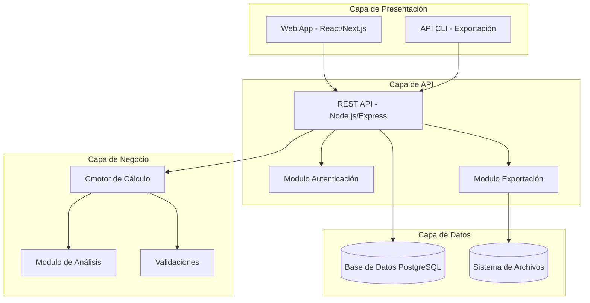
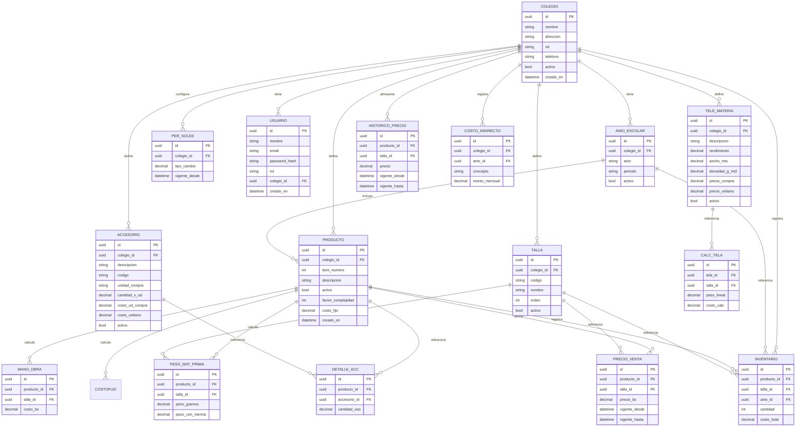
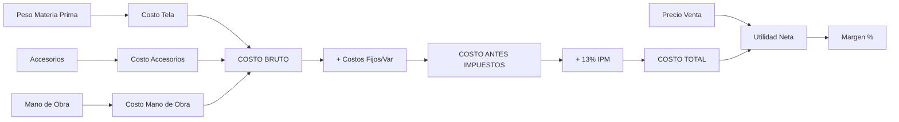

# Plan de Arquitectura: Sistema Centralizado de Gestión de Uniformes Escolares

## 1. Visión General del Sistema

Sistema web multi-colegio para la gestión, cálculo y análisis de costos de producción de uniformes escolares. El sistema replicará y centralizará la lógica de cálculo contenida en el archivo `CAMBRIDGE.xlsx`, permitiendo gestionar múltiples colegios, cada uno con sus propias listas de tallas, productos, precios y costos.

---

## 2. Análisis del Archivo Excel Original

El archivo `CAMBRIDGE.xlsx` contiene las siguientes hojas y lógica:

### 2.1 Hojas de Datos Maestros

| Hoja | Descripción |
|------|-------------|
| `PesoMatPrima` | Peso de materia prima en gramos (+8% merma) por producto y talla |
| `Acc` (Accesorios) | Lista de 38 accesorios/consumibles con cantidades por producto |
| `Tela` | Materias primas (telas) con rendimiento, densidad, precios |
| `ManoDeObra` | Costos de mano de obra por producto y rango de tallas |
| `fijosXprenda` | Factor de complejidad y costo fijo por producto |
| `FijVar` | Costos indirectos mensuales (personal, alquiler, servicios) |

### 2.2 Hojas de Cálculo

| Hoja | Descripción |
|------|-------------|
| `Semit.` | Costos de semiterminados (chompa, chaleco) |
| `CostoBruto` | Tela + Accesorios + Mano de obra (sin fijos) |
| `PrecioDeVenta` | Precios de venta por producto y talla |
| `CostoAntesImp` | Costo bruto + Costos fijos/variables por prenda |
| `CostoTotal` | Costo antes de impuestos + 13% IPM |
| `UtilidadNeta` | Precio de venta - Costo total |
| `%Ganancia` | Margen de utilidad neta % |

### 2.3 Hojas de Inventario

| Hoja | Descripción |
|------|-------------|
| `INVENTARIO` | Stock actual por producto y talla (al 11/11/2022) |
| `CostoInventario` | Valorización del inventario |
| `PrecioAntiguos` | Precios históricos |
| `PrecioAgo2024` | Precios actualizados (agosto 2024) |
| `INVENTARIO (2)` | Plantilla vacía para nuevo inventario |

---

## 3. Arquitectura del Sistema

### 3.1 Diagrama de Componentes



### 3.2 Tecnologías Propuestas

| Capa | Tecnología | Justificación |
|------|-----------|---------------|
| Frontend | React + Next.js + TypeScript | Rendimiento, SEO, tipo seguro |
| Backend | Node.js + Express + TypeScript | Lenguaje unificado, ecosistema rico |
| Base de Datos | PostgreSQL | Relaciones complejas, transacciones |
| Motor de Cálculo | Módulo interno TypeScript | Replicar fórmulas del Excel con precisión |
| Autenticación | JWT + bcrypt | Seguridad estándar |
| Exportación | ExcelJS + Puppeteer | Exportar Excel y PDF |
| UI Library | Ant Design / MUI | Componentes ricos para tablas complejas |

---

## 4. Modelo de Datos

### 4.1 Diagrama ER



### 4.2 Tablas de Resumen

| Tabla | Propósito |
|-------|-----------|
| `colegio` | Datos del colegio (nombre, NIT, dirección) |
| `usuario` | Usuarios del sistema con roles (admin, editor, visualizador) |
| `anio_escolar` | Años escolares activos |
| `producto` | Catálogo de productos por colegio |
| `talla` | Tallas definidas por colegio |
| `peso_mat_prima` | Peso materia prima por producto y talla |
| `tela_materia` | Telas/materias primas con precios |
| `calculote_tela` | Cálculo de costo de tela por producto/talla |
| `accesorio` | Accesorios/consumibles con precios |
| `detalle_acc` | Accesorios por producto |
| `mano_obra` | Costo mano de obra por producto/talla |
| `costo_indirecto` | Costos fijos mensuales del colegio |
| `precio_venta` | Historial de precios de venta |
| `inventario` | Stock actual por producto y talla |
| `precio_historico` | Historial completo de precios |
| `per_soles` | Tipo de cambio soles/bolivianos |

---

## 5. Motor de Cálculo

El núcleo del sistema es la replicación precisa de las fórmulas del Excel:

### 5.1 Cadena de Cálculo



### 5.2 Fórmulas Clave a Implementar

```typescript
// Ejemplo de estructura del motor de cálculo
interface CalculoProducto {
    productoId: string;
    talla: string;
    
    // Materia prima
    pesoMateriaPrima: number;      // gramos
    pesoConMerma: number;          // +8%
    costoTela: number;             // Bs
    
    // Accesorios
    costoAccesorios: number;       // Bs
    
    // Mano de obra
    costoManoObra: number;         // Bs
    
    // Costos calculados
    costoBruto: number;            // tela + accesorios + mano obra
    costoFijosVariable: number;    // por complejidad
    costoAntesImpuestos: number;   // bruto + fijos
    costoTotal: number;            // +13% IPM
    utilidadNeta: number;          // precio venta - costo total
    margenPorcentaje: number;      // (utilidad / precio) * 100
}
```

### 5.3 Mapeo de Hojas Excel a Entidades

| Excel | Base de Datos | Motor |
|-------|--------------|-------|
| PesoMatPrima | `peso_mat_prima` | PesoMateriaPrimaService |
| Acc | `accesorio` + `detalle_acc` | CostoAccesoriosService |
| Tela | `tela_materia` + `calculote_tela` | CostoTelaService |
| ManoDeObra | `mano_obra` | CostoManoObraService |
| fijosXprenda | `producto.factor_complejidad` + `producto.costo_fijo` | CostoFijosService |
| FijVar | `costo_indirecto` | CostosIndirectosService |
| CostoBruto | Calculado | CostoBrutoService |
| PrecioDeVenta | `precio_venta` | PrecioVentaService |
| CostoAntesImp | Calculado | CostoAntesImpuestosService |
| CostoTotal | Calculado | CostoTotalService |
| UtilidadNeta | Calculado | UtilidadService |
| %Ganancia | Calculado | MargenService |

---

## 6. Módulos del Sistema

### 6.1 Módulo de colegios
- CRUD de colegios
- Configuración por colegio (tallas, moneda, tipo de cambio)
- Gestión de usuarios por colegio

### 6.2 Módulo de Productos
- CRUD de productos (items)
- Definición de factor de complejidad
- Costo fijo por producto
- Listas de accesorios por producto

### 6.3 Módulo de Tallas
- Definición personalizada de tallas por colegio
- Mapeo de tallas (ej: 36/XS, 40/M)

### 6.4 Módulo de Materias Primas
- Gestión de telas con precios
- Cálculo automático de costo por rendimiento
- Gestión de accesorios/consumibles

### 6.5 Módulo de Cálculo de Costos
- Motor principal de cálculo
- Visualización tipo spreadsheet
- Cálculo por producto y talla
- Desglose de costos (tela, accesorios, mano de obra, fijos)

### 6.6 Módulo de Inventario
- Registro de stock por producto y talla
- Valorización automática
- Alertas de stock mínimo

### 6.7 Módulo de Precios
- Definición de precios de venta
- Historial de cambios de precio
- Análisis de rentabilidad

### 6.8 Módulo de Análisis y Reportes
- Análisis de margen por producto
- Análisis de valor de inventario
- Reportes de rentabilidad
- Exportación de tablas individuales
- Exportación de análisis completos

### 6.9 Módulo de Exportación
- Exportar tablas a Excel (xlsx)
- Exportar reportes a PDF
- Exportar cálculo completo por producto

---

## 7. Funcionalidades de Exportación y Análisis

### 7.1 Exportación de Tablas Independientes

| Tabla Exportable | Formato | Descripción |
|-----------------|---------|-------------|
| Costo por Producto | Excel/PDF | Desglose completo de costos |
| Inventario | Excel/PDF | Stock y valorización |
| Precios de Venta | Excel/PDF | Con historial |
| Margen de Utilidad | Excel/PDF | Por producto y talla |
| Materias Primas | Excel/PDF | Con costos calculados |
| Accesorios | Excel/PDF | Consumo por prenda |

### 7.2 Análisis Independientes

| Análisis | Descripción |
|----------|-------------|
| Rentabilidad por Producto | Margen % y Bs por talla |
| Comparación de Costos | Entre diferentes años escolares |
| Valor de Inventario | Total y por categoría |
| Precio Óptimo | Sugerencia basada en margen deseado |
| Sensibilidad de Materia Prima | Impacto de cambio en precios de telas |

---

## 8. Roles y Permisos

| Rol | Funcionalidades |
|-----|-----------------|
| Super Admin | Gestionar todos los colegios, crear/eliminar |
| Admin Colegio | Configurar productos, precios, inventario |
| Editor | Editar productos, inventario, precios |
| Visualizador | Solo lectura, exportar reportes |

---

## 9. Plan de Desarrollo por Fases

### Fase 1: Infraestructura y Configuración
- Setup del proyecto (monorepo)
- Configuración de base de datos
- Autenticación y autorización
- CRUD de colegios y usuarios

### Fase 2: Gestión de Catálogos
- CRUD de productos
- CRUD de tallas
- CRUD de telas/materias primas
- CRUD de accesorios

### Fase 3: Motor de Cálculo
- Implementación de fórmulas del Excel
- Cálculo de costo bruto
- Cálculo de costo total
- Cálculo de utilidad y margen

### Fase 4: Gestión de Precios e Inventario
- Precios de venta
- Historial de precios
- Inventario y valorización
- Mano de obra

### Fase 5: Análisis y Exportación
- Dashboard de análisis
- Exportación Excel/PDF
- Reportes de rentabilidad
- Análisis de inventario

### Fase 6: Pulido y Despliegue
- Testing completo
- Optimización de rendimiento
- Documentación
- Despliegue production-ready

---

## 10. Consideraciones Técnicas

### 10.1 Precisión Numérica
- Usar librería decimal para cálculos financieros (decimal.js)
- Evitar errores de punto flotante en cálculos de costos

### 10.2 Multi-tenancy
- Aislamiento de datos por colegio
- Contexto de colegio en cada request
- Validación de acceso a datos

### 10.3 Auditoría
- Log de cambios en precios e inventario
- Historial de modificaciones
- Trazabilidad completa

### 10.4 Backup
- Backup automático diario
- Exportación puntual de datos

---

## 11. Estructura del Proyecto

```
sistema-uniformes/
├── packages/
│   ├── shared/                 # Tipos, utilidades compartidas
│   ├── api/                    # Backend - Node.js/Express
│   │   ├── src/
│   │   │   ├── modules/
│   │   │   │   ├── auth/
│   │   │   │   ├── colegio/
│   │   │   │   ├── producto/
│   │   │   │   ├── talla/
│   │   │   │   ├── tela/
│   │   │   │   ├── accesorio/
│   │   │   │   ├── calculo/
│   │   │   │   │   ├── costoBruto.service.ts
│   │   │   │   │   ├── costoTotal.service.ts
│   │   │   │   │   ├── utilidad.service.ts
│   │   │   │   │   └── margen.service.ts
│   │   │   │   ├── precio/
│   │   │   │   ├── inventario/
│   │   │   │   ├── manoObra/
│   │   │   │   └── export/
│   │   │   ├── database/
│   │   │   ├── middleware/
│   │   │   └── app.ts
│   │   └── prisma/
│   ├── web/                    # Frontend - Next.js/React
│   │   ├── src/
│   │   │   ├── app/
│   │   │   ├── components/
│   │   │   │   ├── productos/
│   │   │   │   ├── calculo/
│   │   │   │   ├── inventario/
│   │   │   │   ├── reportes/
│   │   │   │   └── shared/
│   │   │   ├── hooks/
│   │   │   ├── services/
│   │   │   └── types/
│   │   └── public/
│   └── calc-engine/            # Motor de cálculo independiente
│       ├── src/
│       │   ├── tela.calculator.ts
│       │   ├── accesorio.calculator.ts
│       │   ├── manoObra.calculator.ts
│       │   ├── costoBruto.calculator.ts
│       │   └── index.ts
│       └── tests/
```

---

## 12. Preguntas para el Usuario

Antes de proceder con la implementación, necesito clarificar:

1. **Tecnología preferida**: ¿Tiene preferencia por alguna tecnología en particular? (Node.js, Python, .NET, etc.)

2. **Base de datos**: ¿Prefiere PostgreSQL, MySQL, o SQL Server?

3. **Despliegue**: ¿Dónde se alojara el sistema? (servidor local, cloud, etc.)

4. **Usuarios**: Aproximadamente cuántos colegios se gestionaran y cuántos usuarios por colegio?

5. **Exportación**: Además de Excel y PDF, necesita alguna otra formato de exportación?

6. **Integración**: Necesita integrarse con algún sistema existente?
